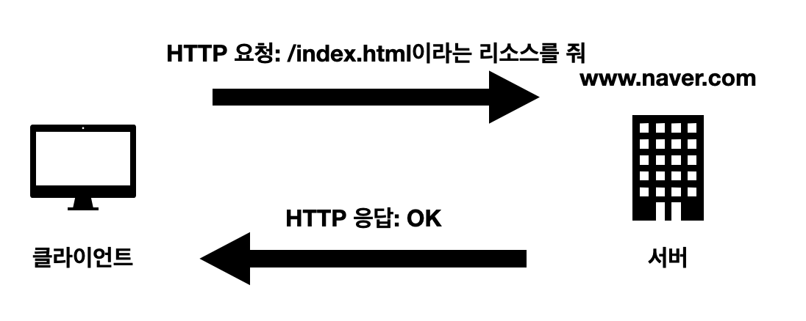
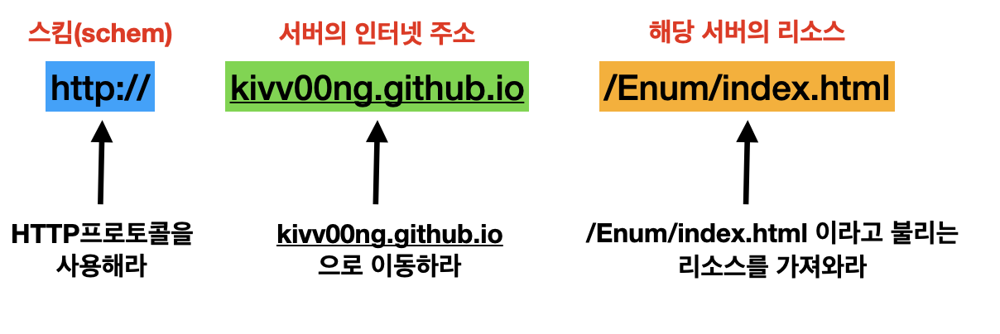
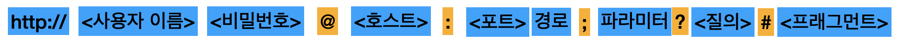
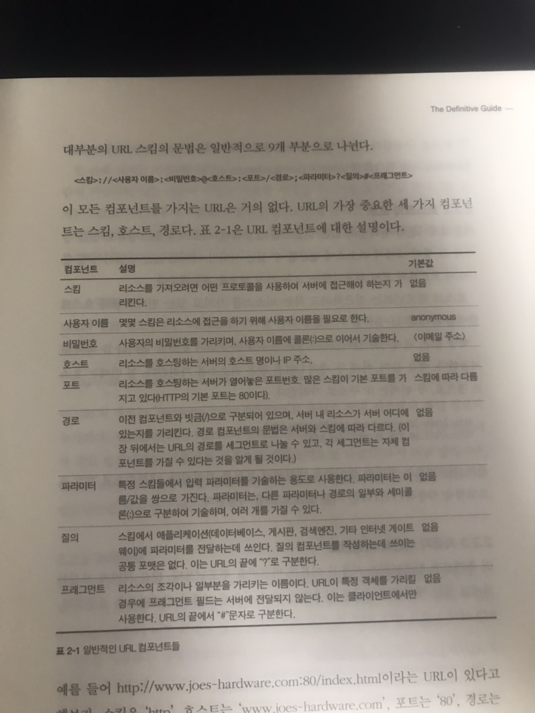

## 1장 http 개관

### 1.1 http란?

HyperText Transfer Protocal의 약자로, 서버와 클라이언트 사이에서 데이터를 주고받는 프로토콜이다.
예를 들어 우리가 크롬과 같은 웹브라우저를 통해 "http://www.naver.com/index.html" 이라는 페이지를 열어본다고 해보자.
여기서 우리가 사용하는 크롬 등의 웹브라우저가 클라이언트에 해당하고,이러한 요청을 받은 www.naver.com 서버는 요청된 데이터를 HTTP응답으로 돌려준다.  
(여기서 서버는 요청받은 데이터(/index.html)를 찾고, 성공했다면 그것의 타입, 길이 등의 정보와 함께 http응답에 실어서 클라이언트에게 보낸다.)


(http는 상태저장이 없는(stateless) 프로토콜이다.)

### 1.2 리소스

웹서버는 웹리소스를 관리하고 제공한다. 웹리소스는 크게 정적파일과 동적 콘텐츠 리소스로 나뉜다.
정적 파일로는 텍스트파일,html파일,워드파일,pdf,이미지파일,영상 파일등을 포함하고,
동적 컨텐츠 리소스는 사용자가 누구인지,어떤 정보를 요청했는지, 몇 시인지에 따라 다른 콘텐츠를 생성한다.
즉,어떤 종류의 콘텐츠 소스도 리소스가 될 수 있다.

### 1.3 URI

이러한 웹리소스들은 우편물 주소와 같은 URI를 통해 식별가능 하다.
(URI란 통합자원 식별자(uniform resource identifier)의 약자)
때문에 클라이언트는 관심있는 리소스를 지목하여 원하는 웹리소스들을 얻을 수 있다.  
이러한 URI는 URL과 URN 이 두가지로 나눌 수 있다.

#### 1.3.1 URL



URL은 통합 자원 지시자(uniform resource locator)의 약자로,리소스 식별자의 가장 흔한 형태이다.
이러한 URL은 대부분 '스킴','서버 주소','리소스 위치'라는 표준 포맷을 따른다.첫 번째 부분인 스킴은 리소스에 접근하기 위해 사용되는 프로토콜을 서술한다.두 번째 부분에서는 서버의 인터넷 주소를 제공하고,마지막 세번째 부분에서는 웹 서버의 리소스를 가리킨다.오늘날의 대부분의 URI는 URL이다.

#### 1.3.2 URN

URN은 (Uniform Resource Name)의 줄임말이다.
URN은 리소스를 어떻게 접근할 것인지(프로토콜을) 명시하지 않고 경로와 리소스 자체를 특정하는 것을 목표로하는 URI이다.  
**책에서 URN은 실험 중인 상태로 나오며(2014년),현재(2022)까지도 그 사용은 찾아보기 힘들다.**

### 1.4 트랜잭션

http트랜잭션은 요청명령과 응답결과로 구성되어있다.이 상호작용은 그림'http예시'에서  
묘사된 것과 같이 http메시지라고 불리는 정형화된 데이터 덩어리를 이용해 이루어진다.

| HTTP메소드 | 설명                                                                 |
| ---------- | -------------------------------------------------------------------- |
| GET        | 서버에서 클라이언트로 지정한 리소스를보내라.                         |
| PUT        | 클라이언트에서 서버로 보낸 데이터를 지정한 이름의 리소스로 저정하라. |
| DELETE     | 지정한 리소스를 서버에서 삭제해 하라.                                |
| POST       | 클라이언트 데이터를 서버 게이트웨이 애플리케이션으로 보내라.         |
| HEAD       | 지정한 리소스에 대한 응답에서 HTTP 헤더 부분만 보내라.               |

| HTTP상태 코드 | 설명                                          |
| ------------- | --------------------------------------------- |
| 200           | 좋다.문서가 바르게 반환되었다.                |
| 300           | 다시 보내라. 다른곳에 가서 리소스를 가져가라. |
| 404           | 없음.리소스를 찾을 수 없다.                   |

(실제 메시지 예시)~~

### 1.5 TCP커넥션

(인터넷 계층~~이미지)
네트워크 개념상 HTTP는 애플리케이션 계층으로 TCP위 계층이다.  
그래서 HTTP는 자신의 메시지 데이터를 전송하기 위해 TCP 프로토콜을 사용한다.  
**TCP는 다음을 제공한다.**

- 오류 없는 데이터 전송
- 순서에 맞는 전달(데이터는 언제나 보낸 순서대로 도착한다)
- 조각나지 않는 데이터 스트림(언제든 어떤 크기로든 보낼 수 있다)

추가로 HTTP는 TCP/IP 프로토콜을 통해 클라이언트와 서버 사이에 TCP/IP 커넥션을 맺는 등의 과정을 거치는데,
다음이 그 순서이다.

```
1.웹브라우저는 서버의 URL 에서 호스트 명을 추출한다.
2.웹브라우저는 서버의 호스트 명을 IP로 변환한다.
3.웹브라우저는 URL에서 포트번호를 추출한다.
4.웹브라우저는 웹 서버와 TCP 커넥션을 맺는다.
5.웹브라우저는 서버에 HTTP 요청을 보낸다.
6.서버는 웹브라우저에 HTTP 응답을 돌려준다.
7.커넥션이 닫히면, 웹브라우저는 문서를 보여준다.
```

### 1.6 웹의 구성요소

- 프락시: 클라이언트와 서버 사이에 위치한 HTTP 중개자
- 캐시: 많이 찾는 웹페이지를 클라이언트 가까이에 보관하는 HTTP 창고
- 게이트웨이: 다른 애ㅐ플리케이션과 연결된 특별한 웹서버
- 터널: 단순히 HTTP 통신을 전달하기만 하는 특별한 프락시
- 에이전트: 자동화된 HTTP 요청을 만드는 준지능적 웹클라이언트

## 2장 URL과 리소스

### 2.1 URL문법



