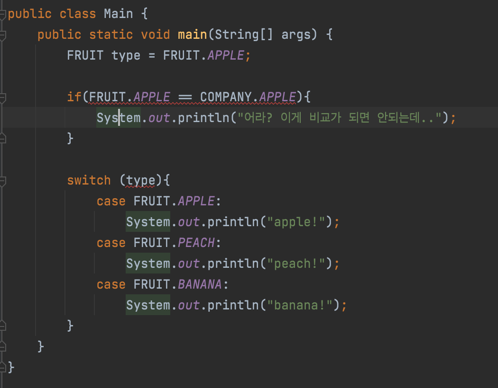
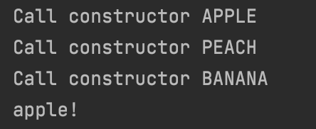
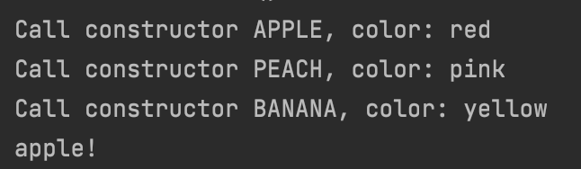

## Enum 이란?

enum은 열거형(enumerated type)이라고 부르며,  
서로 연관된 상수들의 집합입니다.  
그렇다면 왜 Enum을 사용할까요?  
상수 정의를 하는 여러 방법들을 통해 우리는 enum의 등장 배경과  
사용 이유를 알 수 있습니다.

## 여러가지 상수 정의 방법(Enum의 등장 배경)

### 1) 단순 타입 지정 형태

```java
    private static final int APPLE = 1;
    private static final int PEACH = 2;
    private static final int BANANA = 3;

    public static void main(String[] args) {
        int type = APPLE;

        switch (type){
            case APPLE:
                System.out.println("apple!");
                break;
            case PEACH:
                System.out.println("peach!");
                break;
            case BANANA:
                System.out.println("banana!");
                break;
        }
    }
```

우선 우리는 단순하게 타입을 int로 지정한 상수들을 만들어 보았습니다.  
하지만 만약 여기서 company 데이터타입으로 google과 apple 변수를 추가하면 어떻게 될까요?  
apple이라는 변수명이 겹치기 때문에 컴파일 에러가 발생할 것입니다.  
따라서 우리는 접두어를 사용할 해야 할 것입니다.

```java
    private static final int FRUIT_APPLE = 1;
    private static final int FRUIT_PEACH = 2;
    private static final int FRUIT_BANANA = 3;

    private static final int COMPANY_GOOGLE = 1;
    private static final int COMPANY_APPLE = 2;
    private static final int COMPANY_SAMSUNG = 3;
```

컴파일 에러는 해결하였지만,코드가 지저분해 졌습니다.  
만약 다른 데이터 타입이 더 추가된다면 가독성면에서는 점점 더 나빠지겠죠?  
그래서 다른 방법으로 인터페이스를 사용하는 경우도 있습니다.

### 2) 인터페이스

```java
interface FRUIT{
    public static final int APPLE = 1;
    public static final int PEACH = 2;
    public static final int BANANA = 3;
}
interface COMPANY{
    public static final int APPLE = 1;
    public static final int GOOGLE = 2;
    public static final int SAMSUNG = 3;
}
public class Main {
    public static void main(String[] args) {
        int type = FRUIT.APPLE;

        switch (type){
            case FRUIT.APPLE:
                System.out.println("apple!");
                break;
            case FRUIT.PEACH:
                System.out.println("peach!");
                break;
            case FRUIT.BANANA:
                System.out.println("banana!");
                break;
        }
    }
}
```

인터페이스를 사용하니 이전과 비교해 볼 때 상대적으로 가독성이 좋아졌습니다.  
하지만 만약 아래의 코드가 추가된다면 어떻게 될까요?

```java
if(FRUIT.APPLE == COMPANY.APPLE){
            System.out.println("어라? 이게 비교가 되면 안되는데..");
}
```

우리는 처음에 FRUIT 데이터 타입과 COMPANY 데이터 타입을 전혀 다른 것으로 설계했습니다.  
하지만 위와 같은 경우,비교가 가능하여 자칫 의도하지 않은 결과를 초래할 수도 있습니다.  
우리는 이러한 경우에 타입 안전성을 고려하여 컴파일 에러를 발생시키고 싶을 것입니다.

### 3) 클래스

```java
class FRUIT{
    public static final FRUIT APPLE = new FRUIT();
    public static final FRUIT PEACH = new FRUIT();
    public static final FRUIT BANANA = new FRUIT();
}

class COMPANY{
    public static final COMPANY GOOGLE = new COMPANY();
    public static final COMPANY APPLE = new COMPANY();
    public static final COMPANY SAMSUNG = new COMPANY();
}
```

위 코드 처럼 클래스 형태로 각각의 데이터 타입을 만들어 준다면,  
비교하는 과정에서 컴파일 에러를 발생시킬 수 있겠죠?  
하지만 또다른 에러로 switch문에서 컴파일 에러가 발생합니다.  
그 이유는 switch문에서 사용할 수 있는 데이터 타입이 다소 제한적이기 때문입니다.  
(byte,short,char,int,enum,String,Character,Byte,Short,Integer)



### 4) Enum

```java
/*
class FRUIT{
    public static final FRUIT APPLE = new FRUIT();
    public static final FRUIT PEACH = new FRUIT();
    public static final FRUIT BANANA = new FRUIT();
}
 */
enum FRUIT{
    APPLE, PEACH, BANANA;
}
enum COMPANY{
    APPLE, GOOGLE, SAMSUNG;
}
public class Main {
    public static void main(String[] args) {
        FRUIT type = FRUIT.APPLE;

        switch (type){
            case APPLE:
                System.out.println("apple!");
                break;
            case PEACH:
                System.out.println("peach!");
                break;
            case BANANA:
                System.out.println("banana!");
                break;
        }
    }
}
```

드디어 enum 방식으로 변경하여 보았습니다.  
이전 보다 훨씬 간결하게 원하는 바를 달성할 수 있었네요.  
사실 위 주석과 새로 추가한 FRUIT enum의 코드가 의미하는 바는 같습니다.  
예,사실 enum 역시 클래스입니다.위 주석과 같은 클래스 형식의 패턴이 enum 등장 이전까지  
사람들이 일반적으로 사용하던 상수 표현 방식이라고 합니다.  
그래서 java측에서 이를 문법적으로 지원한 것이 바로 enum이라고 하네요.

## Enum 사용 및 특징

### 생성자

```java
enum FRUIT{
    APPLE, PEACH, BANANA;
    FRUIT(){
        System.out.println("Call constructor "+ this);
    }
}
public class Main {
    public static void main(String[] args) {
        FRUIT type = FRUIT.APPLE;
        switch (type){
            case APPLE:
                System.out.println("apple!");
                break;
            case PEACH:
                System.out.println("peach!");
                break;
            case BANANA:
                System.out.println("banana!");
                break;
        }
    }
```



enum은 클래스형태이기때문에 생성자 역시 존재합니다.  
하지만 Enum의 생성자는 private으로만 가능하도록 설계되었습니다.  
그렇기 때문에 클라이언트에서는 인스턴스를 직접 생성하거나 확장할 수 없고,  
처음에 지정한 상수들만이 유일한 인스턴스들이 됩니다.  
이는 enum의 인스턴스 생성을 제어하며 외부적으로 하나의 인스턴스만 가지고 사용되기 때문에  
싱글턴 방식이기도 합니다.

### 필드

```java
enum FRUIT{
    APPLE("red"), PEACH("pink"), BANANA("yellow");
    private final String color;
    FRUIT(String color){
        this.color = color;
        System.out.println("Call constructor "+ this+", color: "+this.color);
    }
}

```

필드 역시 생성자를 통해 추가가 가능합니다.  
하지만 각 열거 타입의 상수들이 final로 만들어진 불변 객체들이기 때문에  
모든 필드 역시 final이어야 합니다.(컴파일 에러는 발생하지 X)



## 정리

**정의**: 서로 연관된 상수들의 집합  
**사용이유**: 타입 안전성과 가독성 + 클래스 형태가 주는 강력한 기능들  
**특징**:

- 싱클턴 방식
- 각 상수들을 해당 타입 class의 'public static final'로 된 인스턴스 필드로 제공
- 클래스형태이기때문에 연관된 메소드나 필드값을 한 곳에 저장할 수 있어서  
  설계 목적 등의 문맥을 담기에도 용이

## 참고 자료

- https://opentutorials.org/module/516/6091
- https://www.nextree.co.kr/p11686/
