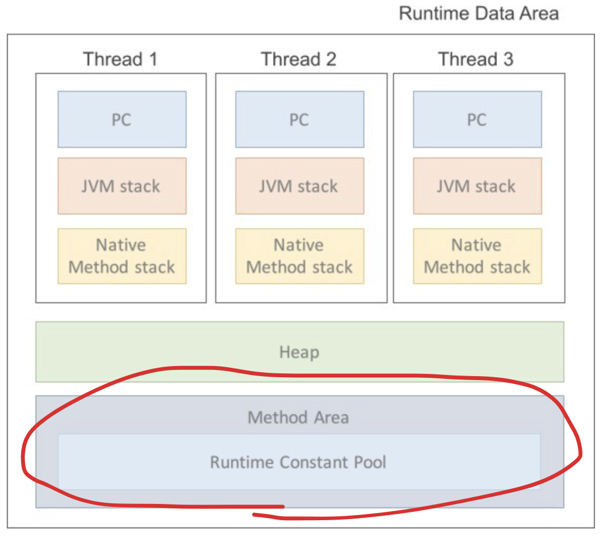

### 왜 자바에서는 상수를 static final로 지정할까?

Java에서는 상수표현을 static final로 쓰는 것이 일반적이다.그리고 그렇게 하라고 다들 피드백 해주었다.그렇다면 왜 그래야할까?여태 그냥 그런 가보다~ 하고 상수라면 응당 static final로 써왔는데 문득 의구심이 들었다.
final은 변수가 아닌 상수 값이니 이해하겠는데,왜 하필 static이어야 할까?
이번 기회에 static을 정리하며 의문점도 해소하고 깊이있게 공부해보자.

### static 이란?

Static은 사전적 의미로 ‘고정된’을 뜻한다.고정된 또는 정적 이라는 의미에 맞게 객체(인스턴스)에 소속된 멤버가 아니라 클래스에 고정된 멤버이다.즉, 클래스 로더가 처음 클래스를 method area라는 메모리 영역에 저장할 때 함께 저장한 다는 뜻이다.

### static 관련 메모리

아래는 java가 os에서 할당 받은 메모리 영역이다.(Runtime Data Area)


우리가 공부할 static 멤버는 methodArea(=Class Area = static Area)에 Class와 함께 저장된다.처음 클래스 정보를 메모리에 저장할 때 함께 저장되는 것이다.
(참고로 객체는 heap에, 각종 메소드와 변수는 stack에 저장된다)

### static 변수

: 메모리에 고정적으로 할당되어, 프로그램이 종료될 때 해제되는 변수이다.

```java
public class Number {
    static int classNum = 1;
    int num = 1;
}

public static void main(String[] args) {
    	Number number1 = new Number();
    	Number number2 = new Number();

    	number1.classNum++;
    	number1.num++;
    	System.out.println(number2.classNum); //결과: 2
    	System.out.println(number2.num);//결과: 1
    }
```

위의 결과 처럼 Number클래스의 인스턴스들은 해당 classNum이라는 정적변수를 함께 공유하고 있고,각 인스턴스들의 필드값인 num은 각 힙영역에서 값을 달리 가지고 있다.

### static 메소드

:static 메소드 역시 메모리에 고정적로 할당되는 메소드이다.  
때문에 별도의 인스턴스 생성없이 사용가능하며,객체에서의 호출 또한 가능하지만 지양된다고 한다.

```java
    public class ResultView {
        static void printStatic() {
            System.out.println("이것이 static 이다!");
        }

        void print(){
            System.out.println("인스턴스 너를 원해!");
        }
    }

    public static void main(String[] args) {
        ResultView.printStatic();

        ResultView resultView = new ResultView();
        resultView.print();
    }
```

### 결론

static을 공부해 보았으니 다시 본론으로 넘어와 보자.그렇다면 왜 자바에서는 상수를 static final로 지정하는 것이 일반적일까?우선 변수가 아닌 상수이므로 final로 지정해준다.이건 이미 공부 전에도 추측 가능한 부분이었다.그렇다면 static은 왜 지정해 주는가? 해당 상수는 클래스 내에서 사용될 예정이고 변하지 않는 값이다.그런데 굳이 우리가 인스턴스를 만들때마다 heap영역에 해당 변수 데이터를 새롭게 저장할 필요가 있을까?이것은 굉장히 비효율적으로 보인다. 그렇기에 static으로 해당 상수를 heap영역이 아닌 메소드 영역에 처음 1번 저장하고 필요할 때마다 사용하는 것이다.  
그렇게 나는 또 하나 배워간다..

### 참고

- https://mangkyu.tistory.com/47?category=872426
- https://coding-factory.tistory.com/524
- https://asfirstalways.tistory.com/158
