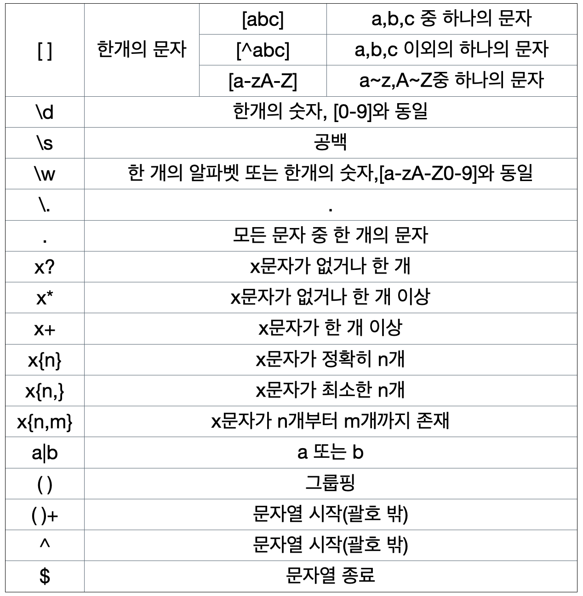
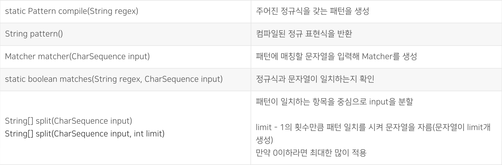
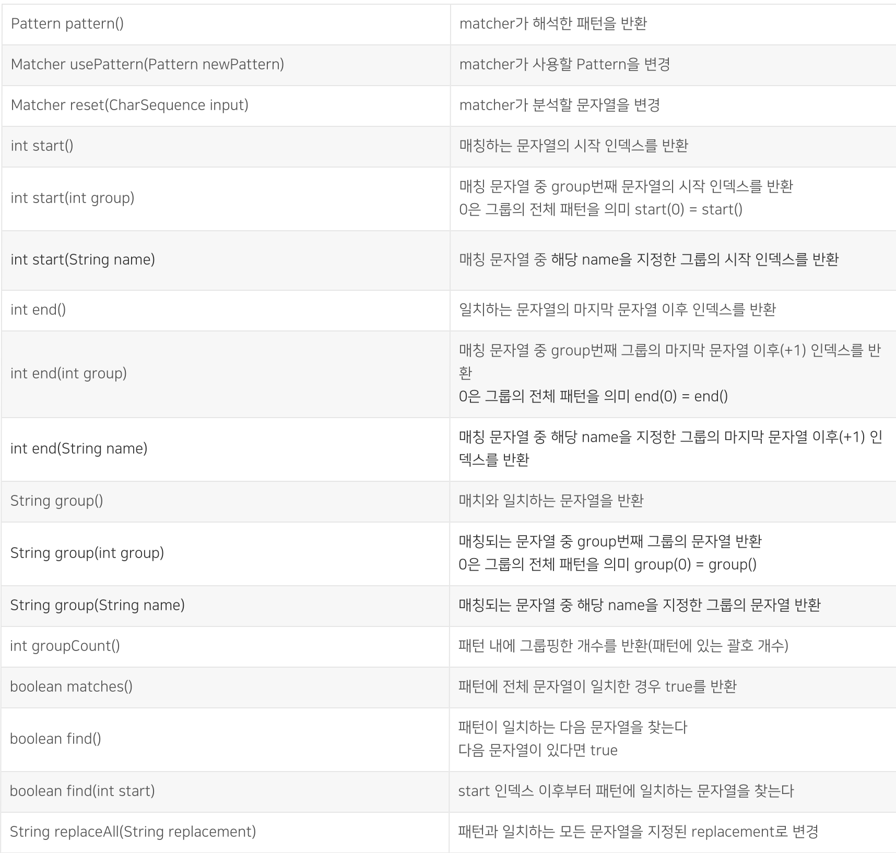

## 정규표현식 이란?

정규 표현식(regular expression, 간단히 regexp 또는 regex) 또는 정규식은  
특정한 규칙을 가진 문자열의 집합을 표현하는데 사용하는 형식 언어이다.

## 작성 방법



## 예제

### 예제1 - 전화번호 형식

```
(02|010)-\d{3,4}-\d{4}
```

02-123-1234 또는 010-1234-5678와 같은
전화번호를 위한 정규표현식이다.
간단히 말하자면 전화번호 형식이 맞는지 아닌지를 확인하기 위해서
만드는 패턴인 것이다.

**(02|010)**:  
첫 번째 부분을 '( )'을 통해 그룹으로 표현해 주었고,  
해당 부분에서는 전화번호의 앞부분이  
02와 010이 와야한다고 지정한 것이다.

'-'는 전화번호를 표현할 때 쓰는 기호이므로 생략하겠다.

**\d{3,4}**:  
'\d'를 통해 숫자임을 표현하여주었고,  
이러한 숫자가 3글자이상 4글자 이하라는 것을 '{3,4}'로 나타내었다.

**\d{4}**
위와 마찬가지로 '\d'를 통해 숫자임을, 그리고 '{4}'를 통해  
4글자가 와야한다고 표현하였다.

### 예제2 - 이메일형식

```
\w+@\w+\.\w+(\.\w+)?
```

white@naver.com과 같은 이메을 위한 정규표현식이다.  
**\w+**:  
'\w'로 한개의 알파벳 또는 숫자을 표현하여 주었고,  
'+'기호를 통해 해당 문자가 한개 이상임을 적시하여 주었다.

'@'는 이메일 표현기법이다.

**\w+**: 위와 마찬가지이다.

'.'역시 이메일 표현기법이다.

**\w+**: 위와 마찬가지이다.

**(\.\w+)?**:  
마지막부분은 '.com'과 같은 형식을 그룹으로 만들어서  
'닷(.)'이 두번 들어가는 이메일 형식을 감안한 표현이다.  
'?'를 통해 없거나 한개 나올 수있음을 적시하여 주었다.

```java
public static void main(String[] args) {
        String regExpCellPhone = "(02|010)-\\d{3,4}-\\d{4}";
        String regExpEmail = "\\w+@\\w+\\.\\w+(\\.\\w+)?";

       checkRegExp(regExpCellPhone,"010-1234-5678"); //정규식과 일치합니다.
       checkRegExp(regExpEmail, "person@navercom"); //정규식과 일치하지 않습니다.
       checkRegExp(regExpEmail, "person@naver.com"); //정규식과 일치합니다.
    }
    private static void checkRegExp(String regExp, String inputString){
        if(Pattern.matches(regExp,inputString)){
            System.out.println("정규식과 일치합니다.");
        }else{
            System.out.println("정규식과 일치하지 않습니다.");
        }
    }
```

## Pattern, Matcher Class

자바에서는 정규식을 활용해 문자열을 검증, 탐색을 돕는 Pattern, Matcher 클래스를 제공해준다.

### Pattern 클래스

Pattern은 정규 표현식이 컴파일된 클래스이다. 정규 표현식에 대상 문자열을 검증하거나,  
활용하기 위해 사용되는 클래스이다.

#### 주요 메소드



### Match 클래스

Pattern클래스를 받아 대상 문자열과 패턴이 일치하는 부분을 찾거나 전체 일치 여부 등을 판별하기 위해 사용된다.

#### 주요 메소드



### 예시

```java
String regex = "^[a-zA-Z]$"; // 영문자만 존재하는가?
String input = "Test String";

System.out.println(Pattern.matches(regex, input)); //false <= 공백존재

Pattern pattern = Pattern.compile(regex); //주어진 정규식을 갖는 패턴을 생성
Matcher matcher = pattern.matcher(input); //패턴에 전체 문자열이 일치한 경우 true

System.out.println(matcher.matches());//false <= 공백존재
```

## 참고자료

- https://www.youtube.com/watch?v=m1KgB90xAfE
- https://girawhale.tistory.com/77
